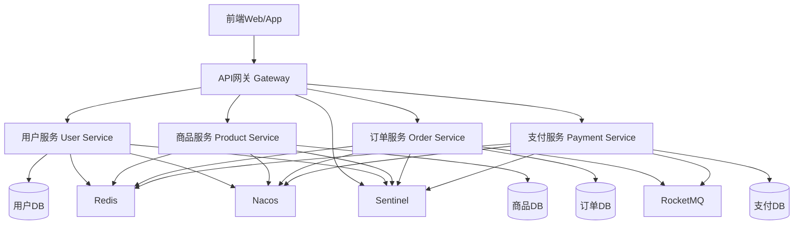

# 电商微服务平台实战

## 📌 项目概述

这是一个完整的电商微服务平台项目，涵盖用户、商品、订单、支付等核心业务模块，采用Spring Cloud Alibaba微服务架构，是学习企业级微服务开发的最佳实战项目。

### 项目特点

```
✅ 完整的业务场景：用户注册登录、商品浏览、下单支付、订单管理
✅ 微服务架构：服务拆分、服务治理、分布式事务
✅ 高并发设计：缓存、限流、降级、熔断
✅ 技术栈先进：Spring Cloud Alibaba、MySQL、Redis、RocketMQ
✅ 生产级代码：完整的异常处理、日志监控、单元测试
```

## 1. 项目架构 ⭐⭐⭐⭐⭐

### 系统架构图



### 技术栈

| 技术 | 版本 | 说明 |
|------|------|------|
| **Spring Boot** | 3.0.x | 基础框架 |
| **Spring Cloud Alibaba** | 2022.x | 微服务框架 |
| **Nacos** | 2.2.x | 注册中心、配置中心 |
| **Sentinel** | 1.8.x | 限流降级 |
| **Seata** | 1.6.x | 分布式事务 |
| **Gateway** | 4.0.x | API网关 |
| **MySQL** | 8.0 | 主数据库 |
| **Redis** | 7.0 | 缓存 |
| **RocketMQ** | 5.0 | 消息队列 |
| **Elasticsearch** | 8.x | 商品搜索 |
| **Skywalking** | 9.x | 链路追踪 |
| **Docker** | 20.x | 容器化 |
| **Kubernetes** | 1.25+ | 容器编排 |

## 2. 服务拆分 ⭐⭐⭐⭐⭐

### 服务列表

```
1. mall-gateway（API网关）
   - 统一入口
   - 路由转发
   - 认证授权
   - 限流降级

2. mall-user（用户服务）
   - 用户注册登录
   - 用户信息管理
   - 地址管理
   - 收藏夹

3. mall-product（商品服务）
   - 商品管理
   - 分类管理
   - 库存管理
   - 商品搜索

4. mall-order（订单服务）
   - 订单创建
   - 订单查询
   - 订单状态管理
   - 订单取消

5. mall-payment（支付服务）
   - 支付处理
   - 退款处理
   - 支付回调
   - 账单查询

6. mall-common（公共模块）
   - 公共实体类
   - 公共工具类
   - 公共常量
   - 统一响应
```

## 3. 核心功能实现 ⭐⭐⭐⭐⭐

### 3.1 用户服务

**用户注册**

```java
@Service
public class UserService {
    
    @Autowired
    private UserRepository userRepository;
    
    @Autowired
    private RedisTemplate<String, Object> redisTemplate;
    
    @Autowired
    private PasswordEncoder passwordEncoder;
    
    /**
     * 用户注册
     */
    @Transactional
    public UserDTO register(RegisterRequest request) {
        // 1. 校验用户名是否存在
        if (userRepository.existsByUsername(request.getUsername())) {
            throw new BusinessException("用户名已存在");
        }
        
        // 2. 校验手机号是否存在
        if (userRepository.existsByPhone(request.getPhone())) {
            throw new BusinessException("手机号已注册");
        }
        
        // 3. 校验验证码
        String codeKey = "sms:code:" + request.getPhone();
        String cachedCode = (String) redisTemplate.opsForValue().get(codeKey);
        if (!request.getCode().equals(cachedCode)) {
            throw new BusinessException("验证码错误");
        }
        
        // 4. 创建用户
        User user = new User();
        user.setUsername(request.getUsername());
        user.setPassword(passwordEncoder.encode(request.getPassword()));
        user.setPhone(request.getPhone());
        user.setNickname(request.getNickname());
        user.setStatus(UserStatus.ACTIVE);
        user.setCreatedAt(LocalDateTime.now());
        
        userRepository.save(user);
        
        // 5. 删除验证码
        redisTemplate.delete(codeKey);
        
        // 6. 返回用户信息
        return UserMapper.toDTO(user);
    }
    
    /**
     * 用户登录
     */
    public LoginResponse login(LoginRequest request) {
        // 1. 查询用户
        User user = userRepository.findByUsername(request.getUsername())
            .orElseThrow(() -> new BusinessException("用户名或密码错误"));
        
        // 2. 校验密码
        if (!passwordEncoder.matches(request.getPassword(), user.getPassword())) {
            throw new BusinessException("用户名或密码错误");
        }
        
        // 3. 校验用户状态
        if (user.getStatus() != UserStatus.ACTIVE) {
            throw new BusinessException("用户已被禁用");
        }
        
        // 4. 生成JWT Token
        String token = JwtUtil.generateToken(user.getId(), user.getUsername());
        
        // 5. 缓存用户信息
        String userKey = "user:info:" + user.getId();
        redisTemplate.opsForValue().set(userKey, user, 30, TimeUnit.MINUTES);
        
        // 6. 返回登录信息
        LoginResponse response = new LoginResponse();
        response.setToken(token);
        response.setUser(UserMapper.toDTO(user));
        
        return response;
    }
}
```

### 3.2 商品服务

**商品查询（多级缓存）**

```java
@Service
public class ProductService {
    
    // L1缓存：本地缓存
    private final Cache<Long, ProductDTO> localCache = Caffeine.newBuilder()
        .maximumSize(10000)
        .expireAfterWrite(5, TimeUnit.MINUTES)
        .build();
    
    @Autowired
    private ProductRepository productRepository;
    
    @Autowired
    private RedisTemplate<String, ProductDTO> redisTemplate;
    
    /**
     * 获取商品详情（多级缓存）
     */
    public ProductDTO getProduct(Long productId) {
        // 1. 查询L1缓存
        ProductDTO product = localCache.getIfPresent(productId);
        if (product != null) {
            log.info("命中本地缓存: productId={}", productId);
            return product;
        }
        
        // 2. 查询L2缓存（Redis）
        String cacheKey = "product:" + productId;
        product = redisTemplate.opsForValue().get(cacheKey);
        if (product != null) {
            log.info("命中Redis缓存: productId={}", productId);
            // 回写L1缓存
            localCache.put(productId, product);
            return product;
        }
        
        // 3. 查询数据库
        Product entity = productRepository.findById(productId)
            .orElseThrow(() -> new NotFoundException("商品不存在"));
        
        product = ProductMapper.toDTO(entity);
        
        // 4. 回写缓存
        redisTemplate.opsForValue().set(cacheKey, product, 30, TimeUnit.MINUTES);
        localCache.put(productId, product);
        
        log.info("查询数据库: productId={}", productId);
        return product;
    }
    
    /**
     * 扣减库存（Redis + Lua脚本保证原子性）
     */
    public boolean decreaseStock(Long productId, Integer quantity) {
        String stockKey = "product:stock:" + productId;
        
        // Lua脚本保证原子性
        String luaScript = 
            "local stock = redis.call('get', KEYS[1]) " +
            "if not stock then " +
            "    return -1 " +
            "end " +
            "if tonumber(stock) >= tonumber(ARGV[1]) then " +
            "    redis.call('decrby', KEYS[1], ARGV[1]) " +
            "    return 1 " +
            "else " +
            "    return 0 " +
            "end";
        
        DefaultRedisScript<Long> redisScript = new DefaultRedisScript<>();
        redisScript.setScriptText(luaScript);
        redisScript.setResultType(Long.class);
        
        Long result = redisTemplate.execute(
            redisScript,
            Collections.singletonList(stockKey),
            String.valueOf(quantity)
        );
        
        if (result == null || result == -1) {
            // 缓存中没有库存，从数据库加载
            Product product = productRepository.findById(productId)
                .orElseThrow(() -> new NotFoundException("商品不存在"));
            redisTemplate.opsForValue().set(stockKey, String.valueOf(product.getStock()));
            return decreaseStock(productId, quantity);
        }
        
        return result == 1;
    }
}
```

### 3.3 订单服务

**订单创建（分布式事务）**

```java
@Service
public class OrderService {
    
    @Autowired
    private OrderRepository orderRepository;
    
    @Autowired
    private ProductClient productClient;
    
    @Autowired
    private RocketMQTemplate rocketMQTemplate;
    
    /**
     * 创建订单（使用Seata分布式事务）
     */
    @GlobalTransactional(name = "create-order", rollbackFor = Exception.class)
    public OrderDTO createOrder(CreateOrderRequest request) {
        // 1. 校验商品信息
        ProductDTO product = productClient.getProduct(request.getProductId());
        if (product == null) {
            throw new BusinessException("商品不存在");
        }
        
        // 2. 校验库存
        if (product.getStock() < request.getQuantity()) {
            throw new BusinessException("库存不足");
        }
        
        // 3. 扣减库存（远程调用商品服务）
        boolean success = productClient.decreaseStock(
            request.getProductId(), 
            request.getQuantity()
        );
        if (!success) {
            throw new BusinessException("扣减库存失败");
        }
        
        // 4. 创建订单
        Order order = new Order();
        order.setOrderNo(generateOrderNo());
        order.setUserId(request.getUserId());
        order.setProductId(request.getProductId());
        order.setProductName(product.getName());
        order.setQuantity(request.getQuantity());
        order.setPrice(product.getPrice());
        order.setTotalAmount(product.getPrice().multiply(BigDecimal.valueOf(request.getQuantity())));
        order.setStatus(OrderStatus.PENDING_PAYMENT);
        order.setCreatedAt(LocalDateTime.now());
        
        orderRepository.save(order);
        
        // 5. 发送订单创建事件
        OrderCreatedEvent event = new OrderCreatedEvent();
        event.setOrderId(order.getId());
        event.setOrderNo(order.getOrderNo());
        event.setUserId(order.getUserId());
        event.setTotalAmount(order.getTotalAmount());
        
        rocketMQTemplate.convertAndSend("order-topic", event);
        
        // 6. 返回订单信息
        return OrderMapper.toDTO(order);
    }
    
    /**
     * 生成订单号
     */
    private String generateOrderNo() {
        // 订单号规则：时间戳 + 随机数
        String timestamp = String.valueOf(System.currentTimeMillis());
        String random = String.valueOf(ThreadLocalRandom.current().nextInt(1000, 9999));
        return timestamp + random;
    }
}
```

### 3.4 支付服务

**支付处理**

```java
@Service
public class PaymentService {
    
    @Autowired
    private PaymentRepository paymentRepository;
    
    @Autowired
    private OrderClient orderClient;
    
    @Autowired
    private RocketMQTemplate rocketMQTemplate;
    
    /**
     * 创建支付订单
     */
    @Transactional
    public PaymentDTO createPayment(CreatePaymentRequest request) {
        // 1. 查询订单信息
        OrderDTO order = orderClient.getOrder(request.getOrderId());
        if (order == null) {
            throw new BusinessException("订单不存在");
        }
        
        // 2. 校验订单状态
        if (order.getStatus() != OrderStatus.PENDING_PAYMENT) {
            throw new BusinessException("订单状态不正确");
        }
        
        // 3. 创建支付记录
        Payment payment = new Payment();
        payment.setPaymentNo(generatePaymentNo());
        payment.setOrderId(order.getId());
        payment.setOrderNo(order.getOrderNo());
        payment.setUserId(order.getUserId());
        payment.setAmount(order.getTotalAmount());
        payment.setPaymentMethod(request.getPaymentMethod());
        payment.setStatus(PaymentStatus.PENDING);
        payment.setCreatedAt(LocalDateTime.now());
        
        paymentRepository.save(payment);
        
        // 4. 调用第三方支付接口（这里模拟）
        String payUrl = callThirdPartyPayment(payment);
        
        // 5. 返回支付信息
        PaymentDTO paymentDTO = PaymentMapper.toDTO(payment);
        paymentDTO.setPayUrl(payUrl);
        
        return paymentDTO;
    }
    
    /**
     * 支付回调
     */
    @Transactional
    public void paymentCallback(PaymentCallbackRequest request) {
        // 1. 查询支付记录
        Payment payment = paymentRepository.findByPaymentNo(request.getPaymentNo())
            .orElseThrow(() -> new BusinessException("支付记录不存在"));
        
        // 2. 校验支付状态
        if (payment.getStatus() != PaymentStatus.PENDING) {
            log.warn("支付状态不正确: paymentNo={}, status={}", 
                request.getPaymentNo(), payment.getStatus());
            return;
        }
        
        // 3. 更新支付状态
        payment.setStatus(PaymentStatus.SUCCESS);
        payment.setPaymentTime(LocalDateTime.now());
        payment.setThirdPartyNo(request.getThirdPartyNo());
        
        paymentRepository.save(payment);
        
        // 4. 发送支付成功事件
        PaymentSuccessEvent event = new PaymentSuccessEvent();
        event.setPaymentId(payment.getId());
        event.setPaymentNo(payment.getPaymentNo());
        event.setOrderId(payment.getOrderId());
        event.setOrderNo(payment.getOrderNo());
        event.setUserId(payment.getUserId());
        event.setAmount(payment.getAmount());
        
        rocketMQTemplate.convertAndSend("payment-topic", event);
        
        // 5. 更新订单状态（远程调用）
        orderClient.updateOrderStatus(payment.getOrderId(), OrderStatus.PAID);
    }
    
    /**
     * 生成支付单号
     */
    private String generatePaymentNo() {
        String timestamp = String.valueOf(System.currentTimeMillis());
        String random = String.valueOf(ThreadLocalRandom.current().nextInt(1000, 9999));
        return "PAY" + timestamp + random;
    }
    
    /**
     * 调用第三方支付接口（模拟）
     */
    private String callThirdPartyPayment(Payment payment) {
        // 实际项目中这里调用支付宝、微信支付等接口
        return "https://pay.example.com?paymentNo=" + payment.getPaymentNo();
    }
}
```

## 4. API网关配置 ⭐⭐⭐⭐⭐

```yaml
# application.yml
spring:
  cloud:
    gateway:
      routes:
        # 用户服务路由
        - id: mall-user
          uri: lb://mall-user
          predicates:
            - Path=/api/user/**
          filters:
            - StripPrefix=2
            - name: RequestRateLimiter
              args:
                redis-rate-limiter.replenishRate: 100
                redis-rate-limiter.burstCapacity: 200
        
        # 商品服务路由
        - id: mall-product
          uri: lb://mall-product
          predicates:
            - Path=/api/product/**
          filters:
            - StripPrefix=2
        
        # 订单服务路由
        - id: mall-order
          uri: lb://mall-order
          predicates:
            - Path=/api/order/**
          filters:
            - StripPrefix=2
            - name: CircuitBreaker
              args:
                name: orderCircuitBreaker
                fallbackUri: forward:/fallback/order
        
        # 支付服务路由
        - id: mall-payment
          uri: lb://mall-payment
          predicates:
            - Path=/api/payment/**
          filters:
            - StripPrefix=2
```

## 5. 部署方案 ⭐⭐⭐⭐⭐

### Docker Compose部署

```yaml
version: '3.8'

services:
  # MySQL
  mysql:
    image: mysql:8.0
    environment:
      MYSQL_ROOT_PASSWORD: root123
    ports:
      - "3306:3306"
    volumes:
      - mysql-data:/var/lib/mysql
  
  # Redis
  redis:
    image: redis:7.0
    ports:
      - "6379:6379"
  
  # Nacos
  nacos:
    image: nacos/nacos-server:v2.2.0
    environment:
      MODE: standalone
    ports:
      - "8848:8848"
  
  # RocketMQ
  rocketmq:
    image: apache/rocketmq:5.0.0
    ports:
      - "9876:9876"
      - "10911:10911"
  
  # Gateway
  gateway:
    image: mall-gateway:latest
    ports:
      - "8080:8080"
    depends_on:
      - nacos
      - redis
  
  # User Service
  user-service:
    image: mall-user:latest
    depends_on:
      - nacos
      - mysql
      - redis
  
  # Product Service
  product-service:
    image: mall-product:latest
    depends_on:
      - nacos
      - mysql
      - redis
  
  # Order Service
  order-service:
    image: mall-order:latest
    depends_on:
      - nacos
      - mysql
      - redis
      - rocketmq
  
  # Payment Service
  payment-service:
    image: mall-payment:latest
    depends_on:
      - nacos
      - mysql
      - redis
      - rocketmq

volumes:
  mysql-data:
```

## 💡 最佳实践

### 1. 代码规范

```
- 使用统一的代码风格（阿里巴巴Java开发手册）
- 使用Lombok简化代码
- 使用MapStruct进行对象转换
- 使用统一的异常处理
- 使用统一的响应格式
```

### 2. 性能优化

```
- 使用多级缓存
- 使用异步处理
- 使用连接池
- 使用批量操作
- 使用索引优化查询
```

### 3. 安全设计

```
- 使用JWT认证
- 使用HTTPS传输
- 敏感数据加密
- 防止SQL注入
- 防止XSS攻击
```

## 🎯 学习建议

```
1. 先理解整体架构
2. 逐个服务学习实现
3. 理解服务间通信
4. 理解分布式事务
5. 理解缓存策略
6. 理解限流降级
7. 动手实践部署
```

## 📚 项目源码

```
GitHub: https://github.com/example/mall-microservice
（示例地址，实际项目请自行实现）
```

---

**恭喜你完成了电商微服务平台的学习！** 🎉

这是一个完整的企业级微服务项目，建议动手实践，加深理解！

