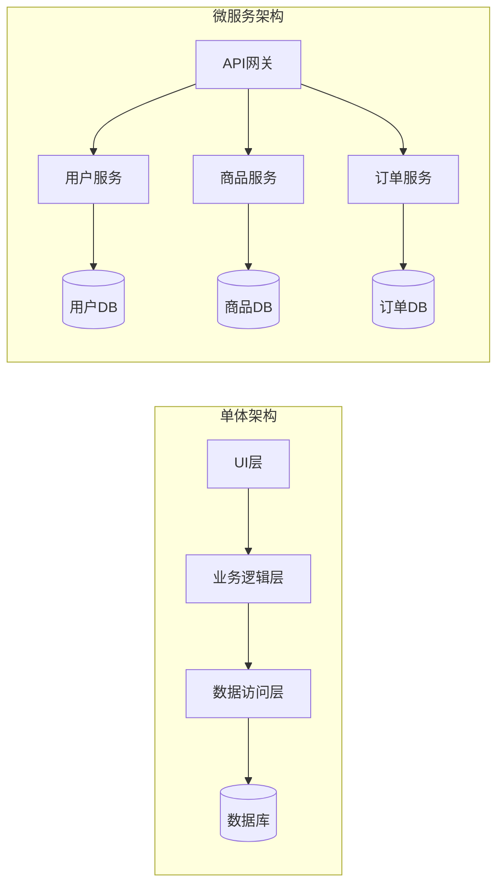
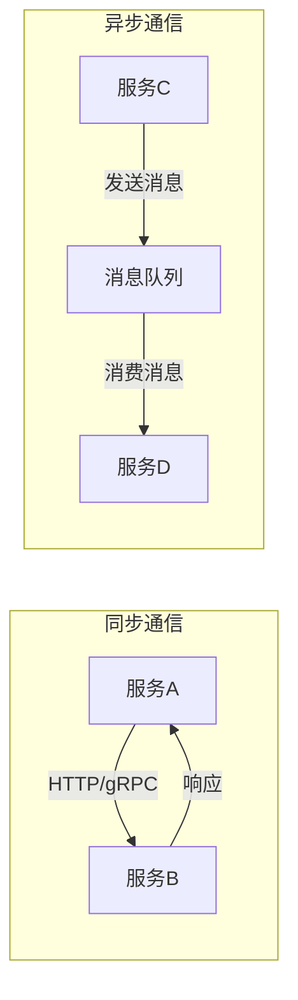

# 微服务架构设计

## 📌 学习目标

- 深入理解微服务架构的核心概念
- 掌握微服务拆分的方法和原则
- 学会设计微服务之间的通信机制
- 理解微服务的数据管理策略
- 掌握微服务的部署和运维

## ⭐ 学习建议

**适合学习阶段**：完成Spring Cloud学习后 ⭐⭐⭐⭐⭐

**前置知识**：
- Spring Boot ⭐⭐⭐⭐⭐
- Spring Cloud ⭐⭐⭐⭐⭐
- Docker/Kubernetes ⭐⭐⭐⭐
- 分布式系统基础 ⭐⭐⭐⭐

## 1. 微服务架构概述 ⭐⭐⭐⭐⭐

### 什么是微服务架构？

```
微服务架构（Microservices Architecture）：
将单一应用程序拆分为一组小型服务的架构风格，
每个服务运行在独立的进程中，服务间通过轻量级机制通信。

核心特征：
1. 服务独立部署
2. 服务独立扩展
3. 服务技术异构
4. 服务故障隔离
5. 服务自治管理
```

### 微服务 vs 单体架构



| 对比维度 | 单体架构 | 微服务架构 |
|---------|---------|-----------|
| **部署** | 整体部署 | 独立部署 |
| **扩展** | 整体扩展 | 按需扩展 |
| **技术栈** | 统一技术栈 | 技术异构 |
| **开发效率** | 初期快，后期慢 | 初期慢，后期快 |
| **故障影响** | 全局影响 | 局部影响 |
| **团队协作** | 紧耦合 | 松耦合 |
| **复杂度** | 低 | 高 |
| **适用场景** | 小型应用 | 大型复杂应用 |

### 微服务架构的优缺点

**优点**：
```
1. 独立部署
   - 服务可以独立发布
   - 不影响其他服务
   - 支持持续交付

2. 技术异构
   - 不同服务可以使用不同技术栈
   - 选择最适合的技术
   - 便于技术升级

3. 故障隔离
   - 单个服务故障不影响全局
   - 提高系统整体可用性
   - 易于定位问题

4. 团队自治
   - 小团队负责单个服务
   - 提高开发效率
   - 减少沟通成本

5. 按需扩展
   - 根据负载扩展特定服务
   - 节省资源成本
   - 提高资源利用率
```

**缺点**：
```
1. 分布式复杂性
   - 网络延迟
   - 分布式事务
   - 数据一致性

2. 运维复杂度
   - 服务数量多
   - 监控难度大
   - 故障排查困难

3. 测试复杂度
   - 集成测试困难
   - 环境搭建复杂
   - 数据准备困难

4. 性能开销
   - 服务间通信开销
   - 序列化/反序列化
   - 网络传输延迟
```

## 2. 微服务拆分原则 ⭐⭐⭐⭐⭐

### 服务拆分的方法

**1. 按业务能力拆分（推荐）**：

```
电商系统拆分示例：

用户服务（User Service）
├── 用户注册
├── 用户登录
├── 用户信息管理
└── 用户权限管理

商品服务（Product Service）
├── 商品管理
├── 分类管理
├── 库存管理
└── 商品搜索

订单服务（Order Service）
├── 订单创建
├── 订单查询
├── 订单状态管理
└── 订单取消

支付服务（Payment Service）
├── 支付处理
├── 退款处理
├── 支付回调
└── 账单查询
```

**2. 按DDD领域拆分**：

```java
// 用户域（User Domain）
@Service
public class UserService {
    // 用户聚合根
    public User createUser(UserCreateCommand command) {
        // 用户注册逻辑
    }
}

// 订单域（Order Domain）
@Service
public class OrderService {
    // 订单聚合根
    public Order createOrder(OrderCreateCommand command) {
        // 订单创建逻辑
    }
}

// 支付域（Payment Domain）
@Service
public class PaymentService {
    // 支付聚合根
    public Payment processPayment(PaymentCommand command) {
        // 支付处理逻辑
    }
}
```

**3. 按数据拆分**：

```
每个服务拥有独立的数据库：

用户服务 → 用户数据库（user_db）
商品服务 → 商品数据库（product_db）
订单服务 → 订单数据库（order_db）
支付服务 → 支付数据库（payment_db）

优点：
✅ 数据隔离，避免耦合
✅ 独立扩展数据库
✅ 技术异构（可以使用不同数据库）

缺点：
❌ 跨服务查询困难
❌ 分布式事务复杂
❌ 数据一致性挑战
```

### 服务拆分的原则

```
1. 单一职责原则
   - 每个服务只负责一个业务领域
   - 避免服务职责过多

2. 高内聚低耦合
   - 相关功能聚合在一起
   - 减少服务间依赖

3. 服务自治
   - 服务独立部署
   - 服务独立数据库
   - 服务独立决策

4. 接口稳定
   - 服务接口向后兼容
   - 避免频繁修改接口
   - 使用版本控制

5. 合理粒度
   - 不要拆分过细（纳米服务）
   - 不要拆分过粗（单体服务）
   - 根据团队规模和业务复杂度决定
```

### 服务拆分的反模式

```
❌ 反模式1：按技术层拆分
   - 前端服务、后端服务、数据库服务
   - 违反业务内聚原则

❌ 反模式2：过度拆分
   - 服务数量过多（> 100个）
   - 增加运维复杂度
   - 降低开发效率

❌ 反模式3：共享数据库
   - 多个服务共享同一个数据库
   - 服务间紧耦合
   - 无法独立扩展

❌ 反模式4：分布式单体
   - 服务间强依赖
   - 必须同时部署
   - 失去微服务优势
```

## 3. 微服务通信机制 ⭐⭐⭐⭐⭐

### 同步通信 vs 异步通信



**同步通信（HTTP/gRPC）**：

```java
// 使用OpenFeign进行同步调用
@FeignClient(name = "product-service")
public interface ProductClient {
    
    @GetMapping("/products/{id}")
    ProductDTO getProduct(@PathVariable Long id);
    
    @PostMapping("/products/{id}/stock")
    boolean updateStock(@PathVariable Long id, 
                       @RequestParam Integer quantity);
}

// 订单服务调用商品服务
@Service
public class OrderService {
    
    @Autowired
    private ProductClient productClient;
    
    public Order createOrder(OrderRequest request) {
        // 1. 查询商品信息
        ProductDTO product = productClient.getProduct(request.getProductId());
        
        // 2. 扣减库存
        boolean success = productClient.updateStock(
            request.getProductId(), 
            -request.getQuantity()
        );
        
        if (!success) {
            throw new BusinessException("库存不足");
        }
        
        // 3. 创建订单
        Order order = new Order();
        order.setProductId(request.getProductId());
        order.setQuantity(request.getQuantity());
        order.setPrice(product.getPrice());
        
        return orderRepository.save(order);
    }
}
```

**异步通信（消息队列）**：

```java
// 使用RocketMQ进行异步通信

// 订单服务：发送订单创建事件
@Service
public class OrderService {
    
    @Autowired
    private RocketMQTemplate rocketMQTemplate;
    
    public Order createOrder(OrderRequest request) {
        // 1. 创建订单
        Order order = new Order();
        order.setProductId(request.getProductId());
        order.setQuantity(request.getQuantity());
        order.setStatus(OrderStatus.PENDING);
        orderRepository.save(order);
        
        // 2. 发送订单创建事件
        OrderCreatedEvent event = new OrderCreatedEvent();
        event.setOrderId(order.getId());
        event.setProductId(order.getProductId());
        event.setQuantity(order.getQuantity());
        
        rocketMQTemplate.convertAndSend("order-topic", event);
        
        return order;
    }
}

// 库存服务：监听订单创建事件
@Service
@RocketMQMessageListener(
    topic = "order-topic",
    consumerGroup = "stock-consumer-group"
)
public class StockService implements RocketMQListener<OrderCreatedEvent> {
    
    @Override
    public void onMessage(OrderCreatedEvent event) {
        // 扣减库存
        boolean success = stockRepository.decreaseStock(
            event.getProductId(), 
            event.getQuantity()
        );
        
        if (success) {
            // 发送库存扣减成功事件
            StockDecreasedEvent stockEvent = new StockDecreasedEvent();
            stockEvent.setOrderId(event.getOrderId());
            rocketMQTemplate.convertAndSend("stock-topic", stockEvent);
        } else {
            // 发送库存不足事件
            StockInsufficientEvent insufficientEvent = new StockInsufficientEvent();
            insufficientEvent.setOrderId(event.getOrderId());
            rocketMQTemplate.convertAndSend("stock-topic", insufficientEvent);
        }
    }
}
```

### 服务间通信的最佳实践

```
1. 优先使用异步通信
   ✅ 降低服务间耦合
   ✅ 提高系统吞吐量
   ✅ 提高系统可用性

2. 同步调用要有超时和重试
   ✅ 设置合理的超时时间
   ✅ 实现重试机制
   ✅ 使用断路器模式

3. 使用API网关统一入口
   ✅ 统一认证授权
   ✅ 统一限流降级
   ✅ 统一日志监控

4. 服务间调用要有链路追踪
   ✅ 使用Skywalking/Zipkin
   ✅ 记录调用链路
   ✅ 快速定位问题
```

## 4. 微服务数据管理 ⭐⭐⭐⭐⭐

### 数据库设计原则

```
1. 每个服务独立数据库
   ✅ 数据隔离
   ✅ 独立扩展
   ✅ 技术异构

2. 避免跨服务事务
   ✅ 使用最终一致性
   ✅ 使用Saga模式
   ✅ 使用事件溯源

3. 数据冗余是可接受的
   ✅ 提高查询性能
   ✅ 减少服务间调用
   ✅ 通过事件同步数据
```

### 分布式事务解决方案

**1. Saga模式**：

```java
// 订单Saga编排
@Service
public class OrderSaga {
    
    public void createOrder(OrderRequest request) {
        try {
            // 步骤1：创建订单
            Order order = orderService.createOrder(request);
            
            // 步骤2：扣减库存
            stockService.decreaseStock(request.getProductId(), request.getQuantity());
            
            // 步骤3：扣减余额
            accountService.decreaseBalance(request.getUserId(), order.getTotalAmount());
            
            // 步骤4：确认订单
            orderService.confirmOrder(order.getId());
            
        } catch (Exception e) {
            // 补偿操作
            compensate(order);
        }
    }
    
    private void compensate(Order order) {
        // 补偿1：取消订单
        orderService.cancelOrder(order.getId());
        
        // 补偿2：恢复库存
        stockService.increaseStock(order.getProductId(), order.getQuantity());
        
        // 补偿3：恢复余额
        accountService.increaseBalance(order.getUserId(), order.getTotalAmount());
    }
}
```

**2. 本地消息表模式**：

```java
// 订单服务：使用本地消息表保证最终一致性
@Service
public class OrderService {
    
    @Autowired
    private OrderRepository orderRepository;
    
    @Autowired
    private OutboxMessageRepository outboxRepository;
    
    @Transactional
    public Order createOrder(OrderRequest request) {
        // 1. 创建订单
        Order order = new Order();
        order.setProductId(request.getProductId());
        order.setQuantity(request.getQuantity());
        orderRepository.save(order);
        
        // 2. 保存到本地消息表
        OutboxMessage message = new OutboxMessage();
        message.setTopic("order-topic");
        message.setPayload(JSON.toJSONString(order));
        message.setStatus(MessageStatus.PENDING);
        outboxRepository.save(message);
        
        return order;
    }
}

// 定时任务：扫描本地消息表并发送消息
@Component
public class OutboxMessageScheduler {
    
    @Scheduled(fixedDelay = 1000)
    public void sendPendingMessages() {
        List<OutboxMessage> messages = outboxRepository
            .findByStatus(MessageStatus.PENDING);
        
        for (OutboxMessage message : messages) {
            try {
                // 发送消息到MQ
                rocketMQTemplate.convertAndSend(
                    message.getTopic(), 
                    message.getPayload()
                );
                
                // 更新消息状态
                message.setStatus(MessageStatus.SENT);
                outboxRepository.save(message);
                
            } catch (Exception e) {
                log.error("发送消息失败", e);
            }
        }
    }
}
```

## 💡 最佳实践

### 1. 微服务设计检查清单

```
服务拆分：
□ 服务职责是否单一？
□ 服务粒度是否合理？
□ 服务间耦合是否最小？

数据管理：
□ 每个服务是否有独立数据库？
□ 是否避免了跨服务事务？
□ 数据一致性方案是否合理？

服务通信：
□ 是否优先使用异步通信？
□ 同步调用是否有超时和重试？
□ 是否有断路器保护？

服务治理：
□ 是否有服务注册发现？
□ 是否有配置中心？
□ 是否有限流降级？

监控运维：
□ 是否有链路追踪？
□ 是否有日志聚合？
□ 是否有监控告警？
```

## 🎯 实战练习

### 练习1：设计电商微服务架构

**需求**：
- 用户注册登录
- 商品浏览购买
- 订单管理
- 支付结算

**任务**：
1. 拆分微服务
2. 设计服务间通信
3. 设计数据库
4. 设计分布式事务方案

### 练习2：实现订单创建流程

**要求**：
- 使用Saga模式
- 实现补偿机制
- 保证最终一致性

## 📚 下一步学习

- [DDD领域驱动设计](../05-微服务与中间件/DDD领域驱动设计.md)
- [分布式事务解决方案](../10-分布式系统实战/分布式事务解决方案.md)
- [服务治理实战](../10-分布式系统实战/服务治理实战.md)

---

**恭喜你完成了微服务架构设计的学习！** 🎉

