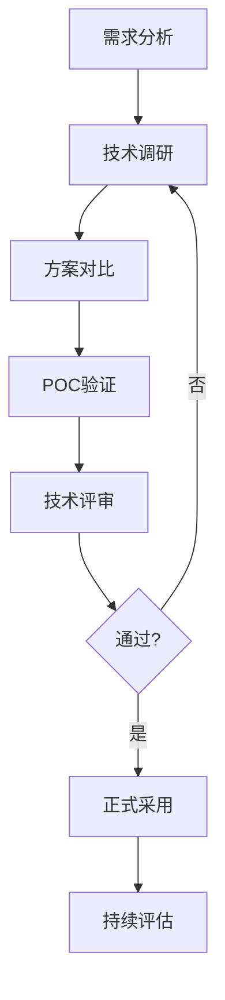

# 技术选型指南

## 📌 学习目标

- 掌握技术选型的原则和方法
- 理解如何评估技术方案的优劣
- 学会进行技术调研和对比
- 掌握技术选型决策的流程
- 理解技术债务的管理

## ⭐ 学习建议

**适合学习阶段**：完成架构设计学习后 ⭐⭐⭐⭐⭐

**前置知识**：
- 系统架构设计方法论 ⭐⭐⭐⭐⭐
- 微服务架构 ⭐⭐⭐⭐
- 项目实战经验 ⭐⭐⭐⭐

## 1. 技术选型概述 ⭐⭐⭐⭐⭐

### 什么是技术选型？

```
技术选型（Technology Selection）：
在项目开发过程中，根据业务需求、团队能力、成本预算等因素，
选择合适的技术栈、框架、工具和平台的过程。

核心目标：
1. 满足业务需求
2. 控制技术风险
3. 提高开发效率
4. 降低维护成本
5. 支持系统演进
```

### 技术选型的重要性

```
✅ 正确的技术选型：
- 提高开发效率
- 降低维护成本
- 提升系统性能
- 支持业务增长

❌ 错误的技术选型：
- 开发效率低下
- 维护成本高昂
- 性能瓶颈明显
- 难以支持业务
- 技术债务累积
```

## 2. 技术选型原则 ⭐⭐⭐⭐⭐

### 核心原则

```
1. 成熟稳定原则 ⭐⭐⭐⭐⭐
   ✅ 选择经过生产验证的技术
   ✅ 社区活跃、文档完善
   ✅ 有成功案例参考
   ❌ 避免使用过于新颖的技术
   ❌ 避免使用无人维护的技术

2. 团队熟悉原则 ⭐⭐⭐⭐⭐
   ✅ 团队有相关经验
   ✅ 学习曲线平缓
   ✅ 培训成本可控
   ❌ 避免全新技术栈
   ❌ 避免小众技术

3. 生态完善原则 ⭐⭐⭐⭐⭐
   ✅ 周边工具丰富
   ✅ 第三方库完善
   ✅ 问题容易解决
   ✅ 社区支持良好

4. 性能满足原则 ⭐⭐⭐⭐⭐
   ✅ 满足性能需求
   ✅ 支持水平扩展
   ✅ 资源消耗合理
   ✅ 有性能优化空间

5. 成本可控原则 ⭐⭐⭐⭐⭐
   ✅ 开源免费或成本可控
   ✅ 运维成本合理
   ✅ 人力成本可控
   ✅ 迁移成本可控

6. 长期维护原则 ⭐⭐⭐⭐
   ✅ 技术有长期支持
   ✅ 版本升级平滑
   ✅ 向后兼容性好
   ✅ 有迁移方案

7. 安全合规原则 ⭐⭐⭐⭐
   ✅ 满足安全要求
   ✅ 符合行业规范
   ✅ 有安全更新
   ✅ 无法律风险
```

### 权衡与取舍

```
技术选型是一个权衡的过程：

性能 vs 开发效率
- 高性能技术（如C++）开发效率低
- 高效率技术（如Python）性能相对较低
- 选择：根据业务场景权衡

成熟稳定 vs 新技术
- 成熟技术稳定但可能落后
- 新技术先进但可能不稳定
- 选择：核心系统用成熟技术，边缘系统可尝试新技术

开源 vs 商业
- 开源免费但需要自己维护
- 商业收费但有专业支持
- 选择：根据预算和技术能力权衡

自研 vs 采购
- 自研灵活但成本高
- 采购快速但定制性差
- 选择：核心竞争力自研，通用功能采购
```

## 3. 技术选型流程 ⭐⭐⭐⭐⭐

### 完整流程



### 步骤1：需求分析 ⭐⭐⭐⭐⭐

```
1. 功能需求
   - 需要实现哪些功能？
   - 有哪些特殊要求？
   - 未来可能的扩展？

2. 非功能需求
   - 性能要求（QPS、响应时间）
   - 可用性要求（SLA）
   - 安全性要求
   - 可扩展性要求

3. 约束条件
   - 预算限制
   - 时间限制
   - 团队能力
   - 技术栈限制
```

### 步骤2：技术调研 ⭐⭐⭐⭐⭐

**调研维度**：

```
1. 技术成熟度
   - 发布时间
   - 版本迭代
   - 生产案例
   - 社区活跃度

2. 性能指标
   - 吞吐量
   - 响应时间
   - 资源消耗
   - 扩展能力

3. 生态完善度
   - 文档质量
   - 周边工具
   - 第三方库
   - 社区支持

4. 学习成本
   - 学习曲线
   - 培训资源
   - 上手难度
   - 团队经验

5. 维护成本
   - 运维复杂度
   - 故障排查
   - 版本升级
   - 人力成本

6. 商业因素
   - 许可证
   - 收费模式
   - 供应商支持
   - 迁移成本
```

### 步骤3：方案对比 ⭐⭐⭐⭐⭐

**对比模板**：

| 对比维度 | 方案A | 方案B | 方案C | 权重 | 得分 |
|---------|-------|-------|-------|------|------|
| **成熟稳定** | 9分 | 7分 | 6分 | 20% | - |
| **性能** | 8分 | 9分 | 7分 | 25% | - |
| **生态** | 9分 | 8分 | 6分 | 15% | - |
| **学习成本** | 7分 | 6分 | 8分 | 10% | - |
| **维护成本** | 8分 | 7分 | 6分 | 15% | - |
| **成本** | 9分 | 6分 | 8分 | 15% | - |
| **总分** | - | - | - | 100% | - |

### 步骤4：POC验证 ⭐⭐⭐⭐⭐

```
POC（Proof of Concept）验证：
通过小规模原型验证技术方案的可行性

验证内容：
1. 功能验证
   - 是否满足核心功能需求？
   - 是否有功能缺失？
   - 是否有功能限制？

2. 性能验证
   - 是否满足性能要求？
   - 是否有性能瓶颈？
   - 是否支持扩展？

3. 集成验证
   - 是否能与现有系统集成？
   - 是否有兼容性问题？
   - 是否有技术冲突？

4. 开发体验验证
   - 开发效率如何？
   - 调试是否方便？
   - 文档是否完善？
```

**POC示例代码**：

```java
// POC：验证Redis作为缓存方案

@SpringBootTest
public class RedisCachePOC {
    
    @Autowired
    private RedisTemplate<String, Object> redisTemplate;
    
    @Test
    public void testBasicOperations() {
        // 1. 测试基本读写
        redisTemplate.opsForValue().set("key1", "value1");
        String value = (String) redisTemplate.opsForValue().get("key1");
        assertEquals("value1", value);
        
        // 2. 测试过期时间
        redisTemplate.opsForValue().set("key2", "value2", 10, TimeUnit.SECONDS);
        assertTrue(redisTemplate.hasKey("key2"));
        
        // 3. 测试复杂对象
        User user = new User("张三", 25);
        redisTemplate.opsForValue().set("user:1", user);
        User cachedUser = (User) redisTemplate.opsForValue().get("user:1");
        assertEquals("张三", cachedUser.getName());
    }
    
    @Test
    public void testPerformance() {
        // 性能测试：10000次读写
        long startTime = System.currentTimeMillis();
        
        for (int i = 0; i < 10000; i++) {
            redisTemplate.opsForValue().set("key:" + i, "value:" + i);
        }
        
        for (int i = 0; i < 10000; i++) {
            redisTemplate.opsForValue().get("key:" + i);
        }
        
        long endTime = System.currentTimeMillis();
        long duration = endTime - startTime;
        
        System.out.println("10000次读写耗时：" + duration + "ms");
        assertTrue(duration < 5000); // 期望5秒内完成
    }
    
    @Test
    public void testConcurrency() throws InterruptedException {
        // 并发测试：100个线程同时读写
        int threadCount = 100;
        CountDownLatch latch = new CountDownLatch(threadCount);
        
        for (int i = 0; i < threadCount; i++) {
            final int index = i;
            new Thread(() -> {
                try {
                    redisTemplate.opsForValue().set("concurrent:" + index, "value:" + index);
                    redisTemplate.opsForValue().get("concurrent:" + index);
                } finally {
                    latch.countDown();
                }
            }).start();
        }
        
        latch.await(10, TimeUnit.SECONDS);
        System.out.println("并发测试完成");
    }
}
```

### 步骤5：技术评审 ⭐⭐⭐⭐⭐

**评审内容**：

```
1. 技术方案评审
   - 是否满足需求？
   - 是否有技术风险？
   - 是否有更好的方案？

2. 成本评审
   - 开发成本是否可控？
   - 运维成本是否合理？
   - ROI是否合理？

3. 风险评审
   - 有哪些技术风险？
   - 有哪些业务风险？
   - 如何应对风险？

4. 团队评审
   - 团队是否有能力？
   - 是否需要培训？
   - 是否需要外部支持？
```

## 4. 常见技术选型场景 ⭐⭐⭐⭐⭐

### 场景1：Web开发框架选型

**需求**：开发企业级Web应用

**候选方案**：

| 框架 | 优点 | 缺点 | 适用场景 |
|------|------|------|---------|
| **Spring Boot** | 生态完善、企业级、稳定 | 相对笨重 | 企业级应用 |
| **Quarkus** | 启动快、内存小、云原生 | 生态较新 | 云原生应用 |
| **Micronaut** | 启动快、编译时注入 | 社区较小 | 微服务应用 |

**推荐**：Spring Boot（成熟稳定，生态完善）

### 场景2：数据库选型

**需求**：存储用户数据和订单数据

**候选方案**：

| 数据库 | 优点 | 缺点 | 适用场景 |
|--------|------|------|---------|
| **MySQL** | 成熟稳定、生态完善、ACID | 扩展性有限 | 关系型数据 |
| **PostgreSQL** | 功能强大、扩展性好 | 学习曲线陡 | 复杂查询 |
| **MongoDB** | 灵活、高性能、易扩展 | 无事务（旧版本） | 非结构化数据 |
| **Redis** | 高性能、丰富数据结构 | 内存限制 | 缓存、会话 |

**推荐**：
- 主数据库：MySQL（成熟稳定）
- 缓存：Redis（高性能）
- 日志/非结构化数据：MongoDB（灵活）

### 场景3：消息队列选型

**需求**：异步处理、削峰填谷

**候选方案**：

| 消息队列 | 优点 | 缺点 | 适用场景 |
|---------|------|------|---------|
| **RocketMQ** | 高可靠、事务消息、顺序消息 | 运维复杂 | 金融、电商 |
| **Kafka** | 高吞吐、持久化、分布式 | 延迟较高 | 日志、大数据 |
| **RabbitMQ** | 功能丰富、易用 | 性能一般 | 中小型应用 |

**推荐**：
- 金融/电商：RocketMQ（高可靠、事务消息）
- 日志/大数据：Kafka（高吞吐）
- 中小型应用：RabbitMQ（易用）

### 场景4：缓存方案选型

**需求**：提高系统性能，减少数据库压力

**候选方案**：

| 缓存方案 | 优点 | 缺点 | 适用场景 |
|---------|------|------|---------|
| **Redis** | 高性能、丰富数据结构、持久化 | 内存限制 | 通用缓存 |
| **Memcached** | 简单、高性能 | 功能单一 | 简单缓存 |
| **Caffeine** | 本地缓存、高性能 | 单机限制 | 本地缓存 |

**推荐**：
- 分布式缓存：Redis（功能丰富）
- 本地缓存：Caffeine（高性能）
- 多级缓存：Caffeine + Redis

## 5. 技术选型决策文档 ⭐⭐⭐⭐⭐

### 文档模板

```markdown
# XX技术选型方案

## 1. 背景
- 项目背景
- 业务需求
- 技术现状

## 2. 需求分析
- 功能需求
- 非功能需求
- 约束条件

## 3. 候选方案
### 方案A
- 技术介绍
- 优点
- 缺点
- 适用场景

### 方案B
- 技术介绍
- 优点
- 缺点
- 适用场景

## 4. 方案对比
| 对比维度 | 方案A | 方案B | 权重 |
|---------|-------|-------|------|
| 成熟稳定 | 9分 | 7分 | 20% |
| 性能 | 8分 | 9分 | 25% |
| ... | ... | ... | ... |

## 5. POC验证
- 验证内容
- 验证结果
- 结论

## 6. 推荐方案
- 推荐方案：方案A
- 推荐理由
- 风险与应对

## 7. 实施计划
- 技术准备
- 团队培训
- 迁移计划
- 时间安排

## 8. 风险评估
- 技术风险
- 业务风险
- 应对措施
```

## 💡 最佳实践

### 1. 技术选型检查清单

```
需求分析：
□ 是否明确功能需求？
□ 是否明确非功能需求？
□ 是否明确约束条件？

技术调研：
□ 是否调研了至少3个方案？
□ 是否查看了官方文档？
□ 是否查看了生产案例？
□ 是否评估了社区活跃度？

方案对比：
□ 是否进行了多维度对比？
□ 是否设置了合理的权重？
□ 是否有量化的评分？

POC验证：
□ 是否进行了功能验证？
□ 是否进行了性能验证？
□ 是否进行了集成验证？

技术评审：
□ 是否通过了技术评审？
□ 是否评估了风险？
□ 是否制定了应对措施？

文档记录：
□ 是否编写了选型文档？
□ 是否记录了决策理由？
□ 是否制定了实施计划？
```

### 2. 避免常见误区

```
❌ 误区1：盲目追新
- 不要为了用新技术而用新技术
- 新技术可能不稳定、坑多
- 团队学习成本高

❌ 误区2：过度设计
- 不要选择过于复杂的方案
- 简单问题简单解决
- 避免过度工程化

❌ 误区3：忽视团队能力
- 不要选择团队不熟悉的技术
- 学习成本和风险很高
- 可能导致项目延期

❌ 误区4：忽视成本
- 不要只看技术先进性
- 要考虑开发和运维成本
- 要考虑人力成本

❌ 误区5：缺乏验证
- 不要直接在生产环境使用
- 一定要进行POC验证
- 要评估风险和影响
```

## 🎯 实战练习

### 练习1：数据库选型

**场景**：
- 开发社交应用
- 需要存储用户信息、帖子、评论
- 预计100万用户，日活10万
- 需要支持复杂查询和全文搜索

**任务**：
1. 分析需求
2. 调研候选方案（至少3个）
3. 进行方案对比
4. 给出推荐方案和理由

### 练习2：缓存方案选型

**场景**：
- 电商系统，商品详情页QPS 10000
- 需要缓存商品信息、库存信息
- 需要支持分布式部署
- 需要保证数据一致性

**任务**：
1. 设计多级缓存方案
2. 选择合适的缓存技术
3. 设计缓存更新策略
4. 评估方案的优缺点

## 📚 下一步学习

- [系统架构设计方法论](./系统架构设计方法论.md)
- [微服务架构设计](./微服务架构设计.md)
- [性能优化](../09-性能优化/高并发系统设计.md)

---

**恭喜你完成了技术选型指南的学习！** 🎉

掌握技术选型方法是成为架构师的关键能力。继续学习，不断实践！

