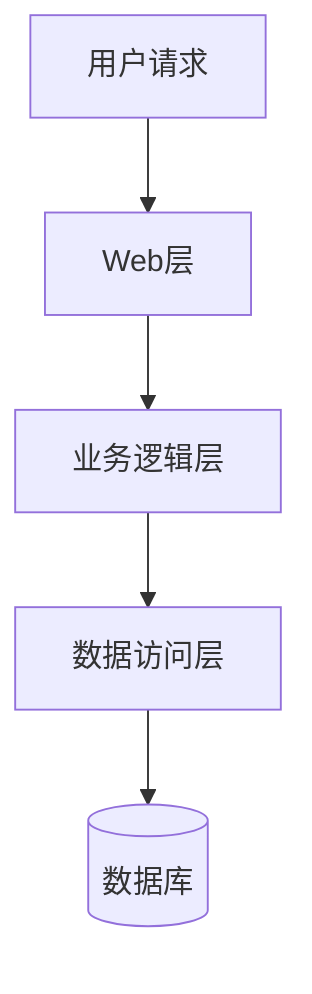
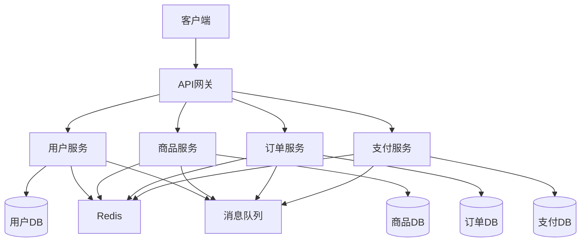
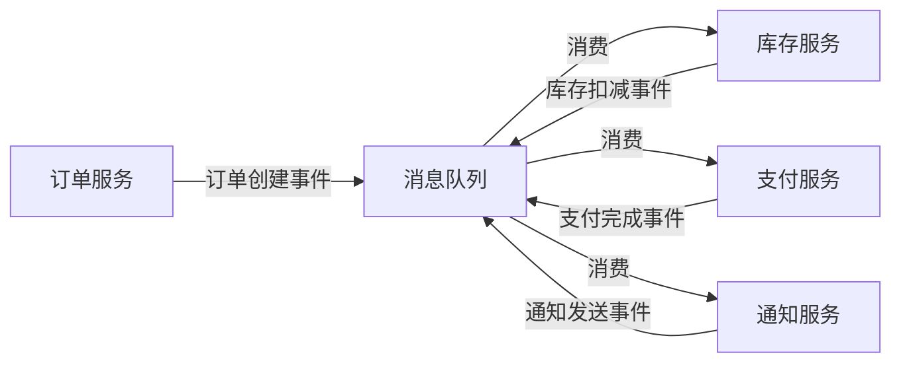
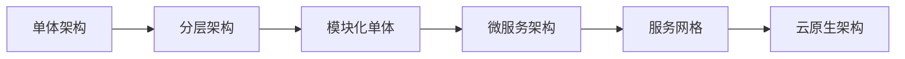

# 架构模式对比

## 📌 学习目标

- 理解各种主流架构模式的特点
- 掌握不同架构模式的适用场景
- 学会根据业务需求选择合适的架构模式
- 理解架构演进的路径和策略

## ⭐ 学习建议

**适合学习阶段**：完成微服务学习后 ⭐⭐⭐⭐⭐

**前置知识**：
- 系统架构设计方法论 ⭐⭐⭐⭐⭐
- 微服务架构 ⭐⭐⭐⭐⭐
- 分布式系统基础 ⭐⭐⭐⭐

## 1. 主流架构模式概览 ⭐⭐⭐⭐⭐

### 架构模式分类

```
按演进历程：
1. 单体架构（Monolithic Architecture）
2. 分层架构（Layered Architecture）
3. SOA架构（Service-Oriented Architecture）
4. 微服务架构（Microservices Architecture）
5. Serverless架构（Serverless Architecture）

按通信方式：
1. 同步架构（Request-Response）
2. 异步架构（Event-Driven Architecture）
3. 混合架构（Hybrid Architecture）

按部署方式：
1. 单机部署
2. 集群部署
3. 容器化部署
4. 云原生部署
```

## 2. 单体架构 ⭐⭐⭐⭐⭐

### 架构图



### 特点

```
优点：
✅ 开发简单：技术栈统一，易于上手
✅ 部署简单：一个应用包，一键部署
✅ 测试简单：集成测试容易
✅ 调试简单：本地运行，易于调试
✅ 性能好：进程内调用，无网络开销

缺点：
❌ 扩展困难：只能整体扩展，无法按需扩展
❌ 技术栈固定：难以引入新技术
❌ 部署风险大：一处修改，全局部署
❌ 代码耦合：模块间边界模糊
❌ 团队协作难：多人修改同一代码库
```

### 适用场景

```
✅ 适合场景：
- 小型应用（< 10万行代码）
- 团队规模小（< 10人）
- 业务简单稳定
- MVP快速验证
- 内部管理系统

❌ 不适合场景：
- 大型复杂系统
- 高并发场景
- 多团队协作
- 需要快速迭代
```

### 代码示例

```java
// 典型的单体架构代码结构
@SpringBootApplication
public class MonolithicApplication {
    public static void main(String[] args) {
        SpringApplication.run(MonolithicApplication.class, args);
    }
}

// Controller层
@RestController
@RequestMapping("/orders")
public class OrderController {
    @Autowired
    private OrderService orderService;
    
    @PostMapping
    public Order createOrder(@RequestBody OrderRequest request) {
        return orderService.createOrder(request);
    }
}

// Service层
@Service
public class OrderService {
    @Autowired
    private OrderRepository orderRepository;
    @Autowired
    private ProductRepository productRepository;
    @Autowired
    private UserRepository userRepository;
    
    @Transactional
    public Order createOrder(OrderRequest request) {
        // 1. 查询用户
        User user = userRepository.findById(request.getUserId());
        
        // 2. 查询商品
        Product product = productRepository.findById(request.getProductId());
        
        // 3. 扣减库存
        product.setStock(product.getStock() - request.getQuantity());
        productRepository.save(product);
        
        // 4. 创建订单
        Order order = new Order();
        order.setUserId(user.getId());
        order.setProductId(product.getId());
        order.setQuantity(request.getQuantity());
        order.setTotalAmount(product.getPrice() * request.getQuantity());
        
        return orderRepository.save(order);
    }
}
```

## 3. 分层架构 ⭐⭐⭐⭐⭐

### 架构图

```
┌─────────────────────────────────┐
│      表现层（Presentation）      │  ← Controller、View
├─────────────────────────────────┤
│      业务逻辑层（Business）      │  ← Service、Domain
├─────────────────────────────────┤
│      数据访问层（Data Access）   │  ← Repository、DAO
├─────────────────────────────────┤
│      基础设施层（Infrastructure）│  ← 数据库、缓存、MQ
└─────────────────────────────────┘
```

### 特点

```
优点：
✅ 职责清晰：每层职责明确
✅ 易于维护：层次分明，易于理解
✅ 易于测试：可以分层测试
✅ 易于替换：可以替换某一层的实现

缺点：
❌ 性能开销：层层调用，性能损耗
❌ 过度设计：简单功能也要经过多层
❌ 层次僵化：难以跨层调用
```

### 代码示例

```java
// 表现层（Controller）
@RestController
@RequestMapping("/api/users")
public class UserController {
    @Autowired
    private UserService userService;
    
    @PostMapping
    public ResponseEntity<UserDTO> createUser(@RequestBody UserRequest request) {
        UserDTO user = userService.createUser(request);
        return ResponseEntity.ok(user);
    }
}

// 业务逻辑层（Service）
@Service
public class UserService {
    @Autowired
    private UserRepository userRepository;
    @Autowired
    private UserMapper userMapper;
    
    public UserDTO createUser(UserRequest request) {
        // 业务逻辑处理
        User user = userMapper.toEntity(request);
        user.setCreatedAt(LocalDateTime.now());
        
        User savedUser = userRepository.save(user);
        return userMapper.toDTO(savedUser);
    }
}

// 数据访问层（Repository）
@Repository
public interface UserRepository extends JpaRepository<User, Long> {
    Optional<User> findByUsername(String username);
}

// 领域模型（Domain）
@Entity
@Table(name = "users")
public class User {
    @Id
    @GeneratedValue(strategy = GenerationType.IDENTITY)
    private Long id;
    
    private String username;
    private String password;
    private LocalDateTime createdAt;
    
    // getters and setters
}
```

## 4. 微服务架构 ⭐⭐⭐⭐⭐

### 架构图



### 特点

```
优点：
✅ 独立部署：服务可以独立发布
✅ 技术异构：不同服务可以使用不同技术
✅ 故障隔离：单个服务故障不影响全局
✅ 按需扩展：根据负载扩展特定服务
✅ 团队自治：小团队负责单个服务

缺点：
❌ 分布式复杂性：网络延迟、分布式事务
❌ 运维复杂度：服务数量多，监控难度大
❌ 测试复杂度：集成测试困难
❌ 性能开销：服务间通信开销
```

### 适用场景

```
✅ 适合场景：
- 大型复杂系统
- 高并发场景
- 多团队协作
- 需要快速迭代
- 需要技术异构

❌ 不适合场景：
- 小型应用
- 团队规模小
- 技术能力不足
- 预算有限
```

## 5. 事件驱动架构 ⭐⭐⭐⭐⭐

### 架构图



### 特点

```
优点：
✅ 松耦合：服务间通过事件通信
✅ 高吞吐：异步处理，提高吞吐量
✅ 易扩展：新增消费者不影响生产者
✅ 削峰填谷：消息队列缓冲流量

缺点：
❌ 调试困难：异步流程难以追踪
❌ 最终一致性：无法保证强一致性
❌ 消息顺序：难以保证消息顺序
❌ 重复消费：需要保证幂等性
```

### 代码示例

```java
// 订单服务：发布订单创建事件
@Service
public class OrderService {
    @Autowired
    private RocketMQTemplate rocketMQTemplate;
    
    public Order createOrder(OrderRequest request) {
        // 1. 创建订单
        Order order = new Order();
        order.setProductId(request.getProductId());
        order.setQuantity(request.getQuantity());
        orderRepository.save(order);
        
        // 2. 发布订单创建事件
        OrderCreatedEvent event = new OrderCreatedEvent();
        event.setOrderId(order.getId());
        event.setProductId(order.getProductId());
        event.setQuantity(order.getQuantity());
        
        rocketMQTemplate.convertAndSend("order-topic", event);
        
        return order;
    }
}

// 库存服务：订阅订单创建事件
@Service
@RocketMQMessageListener(
    topic = "order-topic",
    consumerGroup = "stock-consumer"
)
public class StockEventListener implements RocketMQListener<OrderCreatedEvent> {
    
    @Override
    public void onMessage(OrderCreatedEvent event) {
        // 扣减库存
        stockService.decreaseStock(event.getProductId(), event.getQuantity());
        
        // 发布库存扣减事件
        StockDecreasedEvent stockEvent = new StockDecreasedEvent();
        stockEvent.setOrderId(event.getOrderId());
        rocketMQTemplate.convertAndSend("stock-topic", stockEvent);
    }
}
```

## 6. Serverless架构 ⭐⭐⭐⭐

### 架构图

```
┌─────────────────────────────────┐
│         客户端请求               │
└─────────────────────────────────┘
                ↓
┌─────────────────────────────────┐
│         API网关                  │
└─────────────────────────────────┘
                ↓
┌─────────────────────────────────┐
│    Lambda函数1  Lambda函数2      │
│    Lambda函数3  Lambda函数4      │
└─────────────────────────────────┘
                ↓
┌─────────────────────────────────┐
│    数据库、对象存储、消息队列     │
└─────────────────────────────────┘
```

### 特点

```
优点：
✅ 按需付费：只为实际使用付费
✅ 自动扩展：根据负载自动扩展
✅ 无需运维：无需管理服务器
✅ 快速部署：函数级别部署

缺点：
❌ 冷启动：首次调用延迟高
❌ 供应商锁定：依赖云服务商
❌ 调试困难：本地调试困难
❌ 状态管理：无状态设计
```

### 适用场景

```
✅ 适合场景：
- 短时任务
- 不定期任务
- 事件触发任务
- 快速原型验证

❌ 不适合场景：
- 长时间运行任务
- 有状态应用
- 低延迟要求
- 复杂业务逻辑
```

## 7. 架构模式对比总结 ⭐⭐⭐⭐⭐

### 全面对比表

| 对比维度 | 单体架构 | 分层架构 | 微服务架构 | 事件驱动架构 | Serverless |
|---------|---------|---------|-----------|-------------|-----------|
| **复杂度** | 低 | 中 | 高 | 高 | 中 |
| **开发效率** | 高（初期） | 中 | 低（初期） | 中 | 高 |
| **部署难度** | 低 | 低 | 高 | 高 | 低 |
| **扩展性** | 差 | 中 | 优 | 优 | 优 |
| **可维护性** | 差（后期） | 中 | 优 | 中 | 优 |
| **性能** | 优 | 中 | 中 | 优 | 中 |
| **成本** | 低 | 低 | 高 | 中 | 按需 |
| **团队规模** | 小 | 中 | 大 | 中 | 小 |
| **适用场景** | 小型应用 | 中型应用 | 大型系统 | 异步处理 | 短时任务 |

## 8. 架构演进路径 ⭐⭐⭐⭐⭐

### 典型演进路径



### 演进策略

```
阶段1：单体架构（0-1阶段）
- 快速验证业务
- 快速上线
- 积累用户

阶段2：分层架构（1-10阶段）
- 代码结构优化
- 职责分离
- 提高可维护性

阶段3：模块化单体（10-100阶段）
- 模块边界清晰
- 为微服务做准备
- 降低迁移风险

阶段4：微服务架构（100-1000阶段）
- 服务拆分
- 独立部署
- 支持大规模团队

阶段5：云原生架构（1000+阶段）
- 容器化
- 服务网格
- 自动化运维
```

## 💡 最佳实践

### 架构选择决策树

```
1. 团队规模？
   < 10人 → 单体架构
   10-50人 → 分层架构或模块化单体
   > 50人 → 微服务架构

2. 业务复杂度？
   简单 → 单体架构
   中等 → 分层架构
   复杂 → 微服务架构

3. 并发量？
   < 1000 QPS → 单体架构
   1000-10000 QPS → 分层架构
   > 10000 QPS → 微服务架构

4. 预算？
   有限 → 单体架构
   充足 → 微服务架构

5. 技术能力？
   初级 → 单体架构
   中级 → 分层架构
   高级 → 微服务架构
```

## 🎯 实战练习

### 练习1：架构选型

**场景**：
- 创业公司，开发在线教育平台
- 团队5人，预算有限
- 需要快速上线验证市场

**任务**：
1. 选择合适的架构模式
2. 说明选择理由
3. 规划未来演进路径

### 练习2：架构迁移

**场景**：
- 现有单体电商系统
- 用户量快速增长，性能瓶颈明显
- 团队扩大到30人

**任务**：
1. 设计微服务改造方案
2. 制定迁移计划
3. 评估风险和成本

## 📚 下一步学习

- [系统架构设计方法论](./系统架构设计方法论.md)
- [微服务架构设计](./微服务架构设计.md)
- [技术选型指南](./技术选型指南.md)

---

**恭喜你完成了架构模式对比的学习！** 🎉

