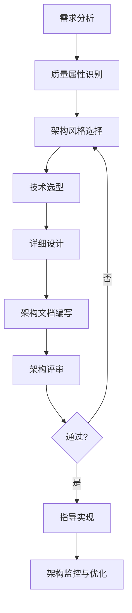

# 系统架构设计方法论

## 📌 学习目标

- 掌握系统架构设计的完整流程
- 理解架构设计的核心原则和方法
- 学会从0到1设计一个系统架构
- 掌握架构文档的编写方法
- 理解架构设计中的权衡与取舍

## ⭐ 学习建议

**适合学习阶段**：完成微服务学习后 ⭐⭐⭐⭐⭐

**前置知识**：
- Spring Boot/Spring Cloud ⭐⭐⭐⭐⭐
- 微服务架构 ⭐⭐⭐⭐⭐
- 数据库设计 ⭐⭐⭐⭐⭐
- 分布式系统基础 ⭐⭐⭐⭐

## 1. 架构设计概述 ⭐⭐⭐⭐⭐

### 什么是架构设计？

```
架构设计（Architecture Design）：
定义系统的组织结构、组件、接口、数据流和技术选型，
以满足业务需求、质量属性和约束条件。

核心目标：
1. 满足功能需求（业务价值）
2. 满足非功能需求（性能、可用性、可扩展性、安全性）
3. 控制技术复杂度
4. 降低开发和维护成本
5. 支持系统演进
```

### 架构师的核心职责

```
1. 需求分析与理解
   - 理解业务需求和技术需求
   - 识别关键质量属性
   - 明确约束条件

2. 架构设计与决策
   - 选择合适的架构风格
   - 进行技术选型
   - 设计系统结构和接口

3. 架构文档编写
   - 编写架构设计文档
   - 绘制架构图
   - 记录设计决策

4. 技术指导与评审
   - 指导团队实现
   - 进行代码评审
   - 解决技术难题

5. 架构演进与优化
   - 监控系统运行
   - 识别架构问题
   - 持续优化改进
```

## 2. 架构设计流程 ⭐⭐⭐⭐⭐

### 完整的架构设计流程



### 步骤1：需求分析 ⭐⭐⭐⭐⭐

**功能需求分析**：

```
1. 识别核心业务场景
   - 用户注册登录
   - 商品浏览购买
   - 订单管理
   - 支付结算

2. 分析业务流程
   - 绘制业务流程图
   - 识别关键路径
   - 明确业务规则

3. 确定功能边界
   - 哪些功能在系统内
   - 哪些功能依赖外部系统
   - 哪些功能未来扩展
```

**非功能需求分析**：

```
1. 性能需求
   - QPS/TPS：每秒请求数/事务数
   - 响应时间：P99 < 200ms
   - 并发用户数：10万在线用户

2. 可用性需求
   - SLA：99.99%可用性（年停机时间 < 53分钟）
   - 故障恢复时间：< 5分钟
   - 数据备份策略

3. 可扩展性需求
   - 支持水平扩展
   - 支持业务快速迭代
   - 支持新功能快速上线

4. 安全性需求
   - 数据加密传输
   - 用户认证授权
   - 防止SQL注入、XSS攻击
   - 敏感数据脱敏

5. 可维护性需求
   - 代码可读性
   - 日志监控完善
   - 故障快速定位
   - 文档完整

6. 成本约束
   - 服务器成本
   - 开发人力成本
   - 运维成本
```

### 步骤2：质量属性识别 ⭐⭐⭐⭐⭐

**质量属性优先级排序**：

```
示例：电商系统质量属性优先级

高优先级（P0）：
1. 可用性 - 系统必须7x24小时运行
2. 性能 - 秒杀场景下高并发处理
3. 安全性 - 支付数据安全

中优先级（P1）：
4. 可扩展性 - 支持业务快速增长
5. 可维护性 - 支持快速迭代

低优先级（P2）：
6. 可移植性 - 暂不考虑跨平台
```

**质量属性场景描述**：

```
场景1：高并发秒杀
- 刺激源：秒杀活动开始
- 环境：10万用户同时抢购100件商品
- 响应：系统正常处理请求，P99响应时间 < 500ms
- 度量：成功处理率 > 99%，无系统崩溃

场景2：服务器故障
- 刺激源：某台服务器宕机
- 环境：正常业务运行中
- 响应：自动切换到其他服务器，用户无感知
- 度量：故障恢复时间 < 30秒，无数据丢失
```

### 步骤3：架构风格选择 ⭐⭐⭐⭐⭐

**常见架构风格对比**：

| 架构风格 | 适用场景 | 优点 | 缺点 |
|---------|---------|------|------|
| **单体架构** | 小型应用、MVP | 简单、开发快、易部署 | 难扩展、技术栈单一 |
| **分层架构** | 中型应用 | 职责清晰、易维护 | 层次过多影响性能 |
| **微服务架构** | 大型复杂系统 | 独立部署、技术异构、高可用 | 复杂度高、运维成本高 |
| **事件驱动架构** | 异步处理、解耦 | 高吞吐、松耦合 | 调试困难、最终一致性 |
| **Serverless** | 短时任务、不定期任务 | 按需付费、自动扩展 | 冷启动、供应商锁定 |

**架构风格选择决策树**：

```
1. 系统规模和复杂度？
   - 小型（< 10人团队）→ 单体架构
   - 中型（10-50人）→ 分层架构或模块化单体
   - 大型（> 50人）→ 微服务架构

2. 团队技术能力？
   - 初级团队 → 单体架构
   - 中级团队 → 分层架构
   - 高级团队 → 微服务架构

3. 业务特点？
   - 业务稳定、变化少 → 单体架构
   - 业务复杂、多团队协作 → 微服务架构
   - 高并发、异步处理 → 事件驱动架构

4. 成本预算？
   - 预算有限 → 单体架构
   - 预算充足 → 微服务架构
```

### 步骤4：技术选型 ⭐⭐⭐⭐⭐

**技术选型原则**：

```
1. 成熟稳定原则
   ✅ 选择经过生产验证的技术
   ✅ 社区活跃、文档完善
   ❌ 避免使用过于新颖的技术

2. 团队熟悉原则
   ✅ 团队有相关经验
   ✅ 学习曲线平缓
   ❌ 避免全新技术栈

3. 生态完善原则
   ✅ 周边工具丰富
   ✅ 第三方库完善
   ✅ 问题容易解决

4. 性能满足原则
   ✅ 满足性能需求
   ✅ 支持水平扩展
   ✅ 资源消耗合理

5. 成本可控原则
   ✅ 开源免费或成本可控
   ✅ 运维成本合理
   ✅ 人力成本可控
```

**技术选型示例：电商系统**：

```java
// 1. 开发框架
Spring Boot 3.x          // 主流、生态完善、团队熟悉
Spring Cloud Alibaba     // 国内微服务首选

// 2. 数据库
MySQL 8.0                // 主数据库
Redis 7.0                // 缓存、分布式锁
MongoDB                  // 日志、非结构化数据
Elasticsearch 8.x        // 商品搜索

// 3. 消息队列
RocketMQ                 // 高可靠、支持事务消息

// 4. 服务治理
Nacos                    // 注册中心、配置中心
Sentinel                 // 限流降级
Seata                    // 分布式事务

// 5. 网关
Spring Cloud Gateway     // 统一网关

// 6. 监控
Prometheus + Grafana     // 指标监控
Skywalking               // 链路追踪
ELK Stack                // 日志分析

// 7. 容器化
Docker + Kubernetes      // 容器编排
```

### 步骤5：详细设计 ⭐⭐⭐⭐⭐

**系统分层设计**：

```
┌─────────────────────────────────────┐
│         客户端层（Client）            │
│  Web浏览器、移动App、小程序           │
└─────────────────────────────────────┘
                 ↓
┌─────────────────────────────────────┐
│         接入层（Gateway）             │
│  API网关、负载均衡、限流、认证         │
└─────────────────────────────────────┘
                 ↓
┌─────────────────────────────────────┐
│         应用层（Application）         │
│  用户服务、商品服务、订单服务、支付服务 │
└─────────────────────────────────────┘
                 ↓
┌─────────────────────────────────────┐
│         数据层（Data）                │
│  MySQL、Redis、MongoDB、Elasticsearch │
└─────────────────────────────────────┘
                 ↓
┌─────────────────────────────────────┐
│         基础设施层（Infrastructure）  │
│  消息队列、配置中心、监控、日志        │
└─────────────────────────────────────┘
```

**服务拆分设计**：

```java
// 按业务领域拆分服务

// 1. 用户服务（User Service）
public interface UserService {
    // 用户注册、登录、信息管理
    UserDTO register(RegisterRequest request);
    UserDTO login(LoginRequest request);
    UserDTO getUserInfo(Long userId);
}

// 2. 商品服务（Product Service）
public interface ProductService {
    // 商品管理、库存管理
    ProductDTO createProduct(ProductRequest request);
    ProductDTO getProduct(Long productId);
    boolean updateStock(Long productId, Integer quantity);
}

// 3. 订单服务（Order Service）
public interface OrderService {
    // 订单创建、查询、状态管理
    OrderDTO createOrder(OrderRequest request);
    OrderDTO getOrder(Long orderId);
    boolean cancelOrder(Long orderId);
}

// 4. 支付服务（Payment Service）
public interface PaymentService {
    // 支付处理、退款
    PaymentDTO pay(PaymentRequest request);
    boolean refund(Long paymentId);
}
```

## 3. 架构设计原则 ⭐⭐⭐⭐⭐

### SOLID原则在架构设计中的应用

```
1. 单一职责原则（SRP）
   - 每个服务只负责一个业务领域
   - 避免服务职责过多

2. 开闭原则（OCP）
   - 通过扩展实现新功能，而不是修改现有代码
   - 使用插件化、配置化设计

3. 里氏替换原则（LSP）
   - 服务接口的实现可以互相替换
   - 保证接口契约的一致性

4. 接口隔离原则（ISP）
   - 服务接口细粒度设计
   - 避免胖接口

5. 依赖倒置原则（DIP）
   - 依赖抽象而不是具体实现
   - 使用接口定义服务契约
```

### 高内聚低耦合

```
高内聚：
- 相关功能聚合在一起
- 服务内部职责清晰
- 减少服务间依赖

低耦合：
- 服务间通过接口通信
- 避免直接依赖实现
- 使用异步消息解耦
```

### 12-Factor App原则

```
1. 代码库：一份代码，多处部署
2. 依赖：显式声明依赖
3. 配置：配置与代码分离
4. 后端服务：把后端服务当作附加资源
5. 构建、发布、运行：严格分离
6. 进程：应用以无状态进程运行
7. 端口绑定：通过端口绑定提供服务
8. 并发：通过进程模型进行扩展
9. 易处理：快速启动和优雅终止
10. 开发环境与线上环境等价
11. 日志：把日志当作事件流
12. 管理进程：后台管理任务当作一次性进程运行
```

## 💡 最佳实践

### 1. 架构设计文档模板

```markdown
# XX系统架构设计文档

## 1. 系统概述
- 系统背景
- 业务目标
- 用户群体

## 2. 需求分析
- 功能需求
- 非功能需求
- 约束条件

## 3. 架构设计
- 架构风格
- 系统分层
- 服务拆分
- 技术选型

## 4. 详细设计
- 核心流程设计
- 数据模型设计
- 接口设计
- 安全设计

## 5. 部署架构
- 部署拓扑图
- 资源规划
- 容灾方案

## 6. 监控运维
- 监控指标
- 告警策略
- 运维流程

## 7. 风险与挑战
- 技术风险
- 业务风险
- 应对措施
```

### 2. 架构评审检查清单

```
功能性：
□ 是否满足所有功能需求？
□ 是否考虑了未来扩展？

性能：
□ 是否满足性能指标？
□ 是否有性能瓶颈？
□ 是否支持水平扩展？

可用性：
□ 是否有单点故障？
□ 是否有容灾方案？
□ 是否有降级策略？

安全性：
□ 是否有认证授权？
□ 是否有数据加密？
□ 是否防止常见攻击？

可维护性：
□ 架构是否清晰易懂？
□ 是否有完善的文档？
□ 是否易于调试和排查问题？

成本：
□ 开发成本是否可控？
□ 运维成本是否合理？
□ 是否有成本优化方案？
```

## 🎯 实战练习

### 练习1：设计一个在线教育系统

**需求**：
- 支持10万学生在线学习
- 支持视频点播和直播
- 支持作业提交和批改
- 支持在线考试

**任务**：
1. 分析功能需求和非功能需求
2. 选择合适的架构风格
3. 进行服务拆分
4. 进行技术选型
5. 绘制架构图

### 练习2：优化现有系统架构

**场景**：
- 现有单体电商系统
- 用户量快速增长，性能瓶颈明显
- 团队规模扩大，开发效率下降

**任务**：
1. 分析现有架构问题
2. 设计微服务改造方案
3. 制定迁移计划
4. 评估风险和成本

## 📚 下一步学习

- [微服务架构设计](./微服务架构设计.md) - 深入学习微服务架构
- [架构模式对比](./架构模式对比.md) - 对比各种架构模式
- [技术选型指南](./技术选型指南.md) - 掌握技术选型方法
- [性能优化](../09-性能优化/高并发系统设计.md) - 学习高并发系统设计

---

**恭喜你完成了系统架构设计方法论的学习！** 🎉

掌握架构设计方法论是成为高级工程师的关键一步。继续学习，不断实践！

